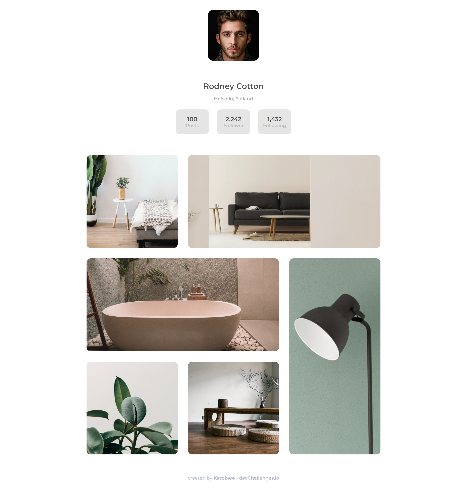

<!-- Please update value in the {}  -->

<h1 align="center">My Gallery</h1>

<div align="center">
   Solution for a challenge from  <a href="http://devchallenges.io" target="_blank">Devchallenges.io</a>.
</div>

<div align="center">
  <h3>
    <a href="https://elegant-rosalind-51aaa9.netlify.app">
      Demo
    </a>
    <span> | </span>
    <a href="https://github.com/Karobwe/devchallenges-my-gallery">
      Solution
    </a>
    <span> | </span>
    <a href="https://devchallenges.io/challenges/gcbWLxG6wdennelX7b8I">
      Challenge
    </a>
  </h3>
</div>

<!-- TABLE OF CONTENTS -->

## Table of Contents

- [Overview](#overview)
  - [Built With](#built-with)
- [Features](#features)
- [Contact](#contact)
- [Acknowledgements](#acknowledgements)

<!-- OVERVIEW -->

## Overview



I've used grid template a lot since years but never had to implement complex grid where I have to specify which column/row an element should start/end. So this was interesting to do it here. checkout the [live demo](https://elegant-rosalind-51aaa9.netlify.app). 

### Built With

<!-- This section should list any major frameworks that you built your project using. Here are a few examples.-->

- [Webpack Encore](https://symfony.com/doc/current/frontend.html)
- [SASS](https://sass-lang.com/)

## Features

<!-- List the features of your application or follow the template. Don't share the figma file here :) -->

This application/site was created as a submission to a [DevChallenges](https://devchallenges.io/challenges) challenge. The [challenge](https://devchallenges.io/challenges/gcbWLxG6wdennelX7b8I) was to build an application to complete the given user stories.

- [x] User story: I can see a page following the given design

## How To Use

To clone and run this application, you'll need [Git](https://git-scm.com) and [Node.js](https://nodejs.org/en/download/) (which comes with [npm](http://npmjs.com)) installed on your computer. From your command line:

```bash
# Clone this repository
$ git clone https://github.com/your-user-name/your-project-name

# Install dependencies
$ npm install

# Run the app
$ npm start
```

## Acknowledgements

<!-- This section should list any articles or add-ons/plugins that helps you to complete the project. This is optional but it will help you in the future. For exmpale -->

- [A Complete Guide to Grid](https://css-tricks.com/snippets/css/complete-guide-grid/)
- [How to cover a div with an img tag](https://stackoverflow.com/questions/44091567/how-to-cover-a-div-with-an-img-tag-like-background-image-does)

## Contact

- Website [karobwe.dev](https://karobwe.dev)
- GitHub [@Karobwe](https://github.com/Karobwe)
- Twitter [@Karobwe](https://twitter.com/Karobwe)
